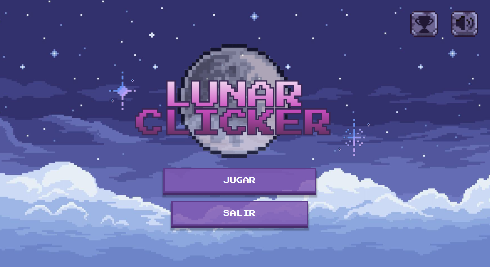
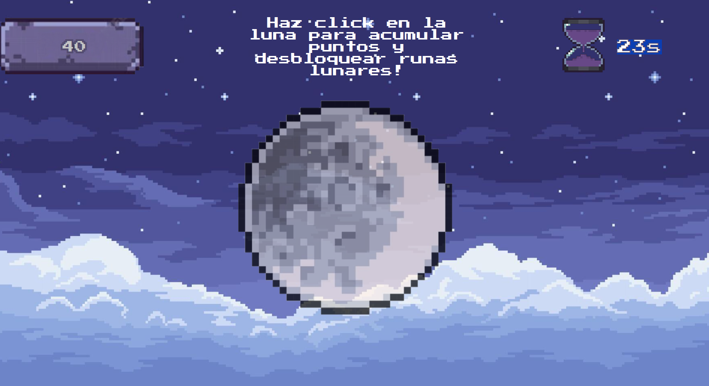
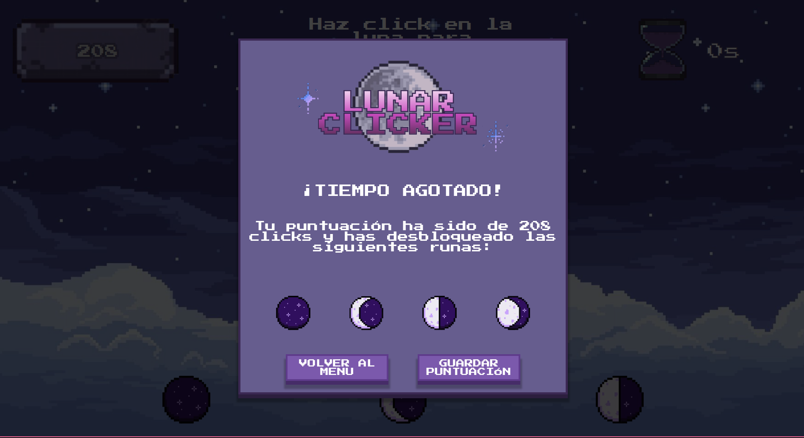
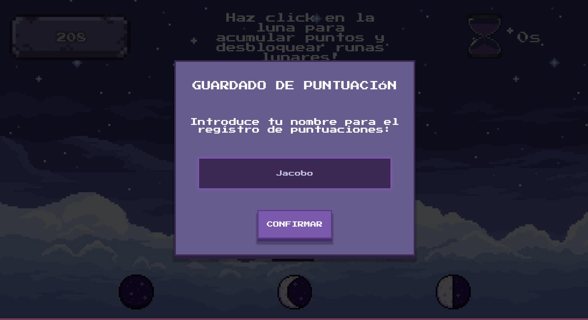
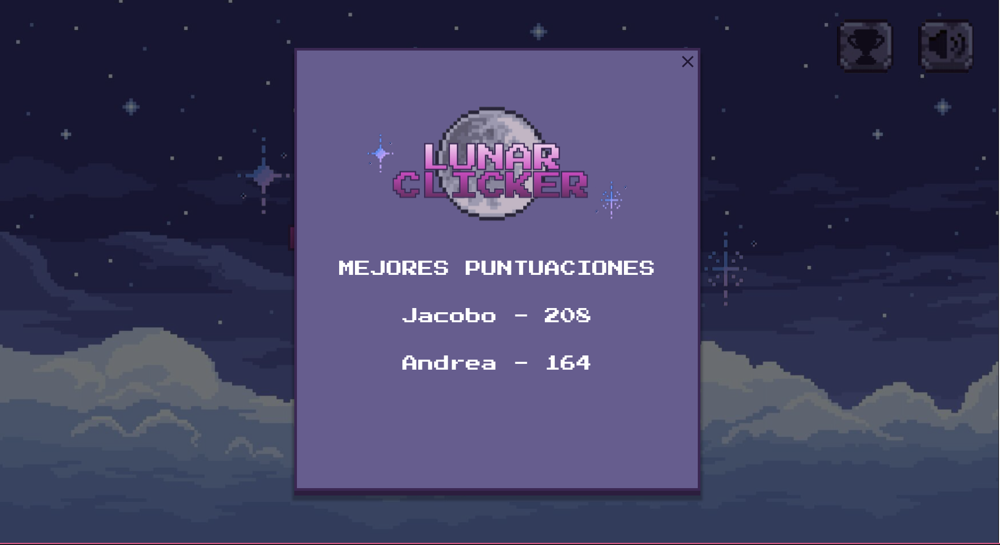

# Lunar Clicker

Lunar Clicker es una aplicación de escritorio interactiva desarrollada con Angular y Electron. El proyecto combina una mecánica de juego tipo clicker con una atmósfera mística inspirada en el universo de Lunacid. Los jugadores deben recolectar runas lunares mediante clics precisos antes de que el tiempo se agote, registrando sus hazañas en una base de datos local persistente.

## Características principales:

- **Mecánica Clicker Inmersiva:** Sistema de interacción directa con la Luna mediante eventos de puntero, optimizado para una respuesta inmediata y feedback visual (escalado y animaciones de flotación).

- **Atmósfera Sonora Dinámica:** Integración de audio que permite solapar sonidos de impacto y una banda sonora ambiental (Sucsarius Phase 2 - Lunacid BSO) que gestiona su estado según la navegación del usuario.

- **Sistema de Progresión por Runas:** Lógica de desbloqueo basada en hitos de puntuación. Las runas se revelan dinámicamente en la interfaz mediante bindings condicionales de Angular a medida que el jugador alcanza objetivos específicos.

- **Temporizador de Misión:** Cuenta atrás gestionada mediante intervalos asíncronos con detección de cambios forzada para garantizar una precisión de milisegundos en la interfaz de usuario.

- **Persistencia de Datos con SQLite:** Integración de una base de datos relacional nativa mediante el proceso principal de Electron, permitiendo el almacenamiento persistente de nombres y puntuaciones de los jugadores.

- **Arquitectura Multiproceso Segura:** Implementación de un puente de comunicación (IPC) mediante un archivo preload, garantizando que la lógica del juego (Renderer) no tenga acceso directo al sistema de archivos, siguiendo las mejores prácticas de seguridad de Electron.

- **Interfaz de Usuario Retro-Moderna:** Diseño UI inspirado en la estética de 32 bits, utilizando fuentes pixel-art, sombras proyectadas y una paleta de colores mística para evocar una experiencia de juego clásica.

- **Navegación Programática:** Sistema de rutas de Angular (Angular Router) para transiciones fluidas entre el menú principal y la zona de ritual, gestionando la limpieza de procesos (audios y timers) en el ciclo de vida de los componentes.

---

## Diseño en figma:

[https://www.figma.com/design/1lxjPeaACGYqBKUquRlfE5/lunarClicker?node-id=0-1&t=KVXK79SIHg7o9sV8-1](https://www.figma.com/design/1lxjPeaACGYqBKUquRlfE5/lunarClicker?node-id=0-1&t=KVXK79SIHg7o9sV8-1)

---

## Tecnologías utilizadas:

- **Framework Frontend:** Angular
- **Entorno de Escritorio:** Electron
- **Lenguaje principal:** TypeScript / JavaScript
- **Base de Datos:** SQLite3 (Persistencia local nativa)
- **Comunicación:** Electron IPC (Inter-Process Communication)
  
---

## Imágenes en ejecución:

### Menú Principal

## Gameplay

## Desbloqueo de runas

## Guardado de puntuaciones

## Ranking de puntuaciones
